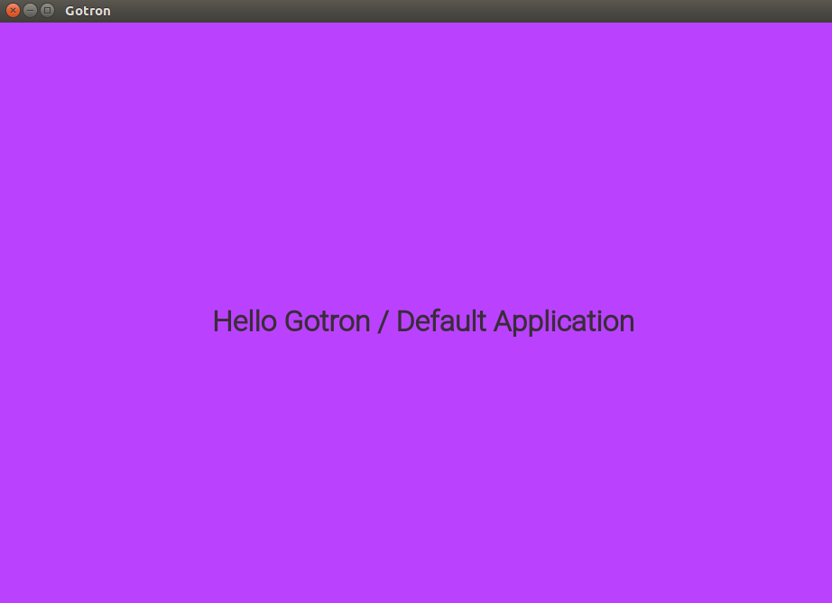

[](https://travis-ci.org/Equanox/gotron)

# Gotron
A go api for electronjs.

**IMPORTANT NOTICE:**     
This repository has undergone a complete rewrite. It is no longer a boilerplate application, it rather is a full electronJS api in go containing a golang <=> nodejs bridge. You can now `go get` this package and import it from your go application. 
The deprecated gotron boilerplate code can still be accessed using the gotron-boilerplate branch. Be aware that it wont't be maintained and will disapear without notice.    

## Prerequisites
**go1.11** with modules enabled, **nodejs** and **npm** must be available on your system.

## Quick Start
On the first run it will download electronjs and stores it in *.gotron* in your working directory.

```go
package main

import (
    "github.com/Equanox/gotron"
)

func main() {
    // Create a new browser window instance
    window, err := gotron.New()
    if err != nil {
        panic(err)
    }

    // Alter default window size and window title.
    window.WindowOptions.Width = 1200
    window.WindowOptions.Height = 980
    window.WindowOptions.Title = "Gotron"

    // Start the browser window.
    // This will establish a golang <=> nodejs bridge using websockets,
    // to control ElectronBrowserWindow with our window object.
    done, err := window.Start()
    if err != nil {
        panic(err)
    }
    
    // Open dev tools must be used after window.Start 
    // window.OpenDevTools()
    
    // Wait for the application to close
    <-done
}
```     

When everything worked you should see this




### Use Your Own WebUI
gotron expects a folder containing your HTML/JS/CSS code and passes it to electronJS. make sure it contains at least a index.html as entrypoint.

Pass a path to your webUI on gotrons `New(uiFolder ...string)` function.
```go
window, err := gotron.New("path/to/your/webui")
if err != nil {
    panic(err)
}
```

## Distribution/Packaging
To package a go application together with electornjs use `gotron-builder`.    

#### Install gotron-builder
We provide executables for Linux, MacOS and Windows.    
Download the newest release from [https://github.com/Equanox/gotron/releases](https://github.com/Equanox/gotron/releases) and add it to your $PATH.

#### Using  gotron-builder
It expects...
* a directory containing a golang main package 
* and a directory with a webUI containing at least a index.html

By default it will implicitly use...
* golang main package from the current directory
* webUI from *.gotron/assets*

To pack the code from **Quick Start** use
```sh
gotron-builder
```
in the root of your repo.

Pass your go code and webUI explicitly.
```sh
gotron-builder --go=your/go/dir --app=your/webapp/dir
```

For cross compilation you can use the same flags as electron-builder would expect them
```
gotron-builder --win 
```
Read about the requirements for cross-compilation in [electron-builders](https://github.com/electron-userland/electron-builder) documentation.

## Tasks
- [x] Basic js + webpack example
- [x] React example
- [x] Typescript-React example
- [x] Vue.js example
- [ ] Elm example
- [ ] Flutter Hummingbird example
- [X] Hide nodejs/electron behind go api
- [X] Create executables for Win, Linux, MacOSbenchkram-logo
- [X] Hide nodejs/electron behind go api
- [ ] Msgs between golang and electronJS renderer process,
      abstracted in a javascript/typescript package
- [ ] Implement complete BrowserWindow api see => [BrowserWindow.md](BrowserWindow.md)
- [ ] Implement complete electron-builder api in gotron-builder

## Sponsors
<a href="https://benchkram.de"></a>

# License
MIT  

Except Roboto (ui/js/src/Roboto-Light.ttf , ui/react/src/Roboto-Light.ttf) which is licensed under Apache 2.0   
https://github.com/google/roboto
